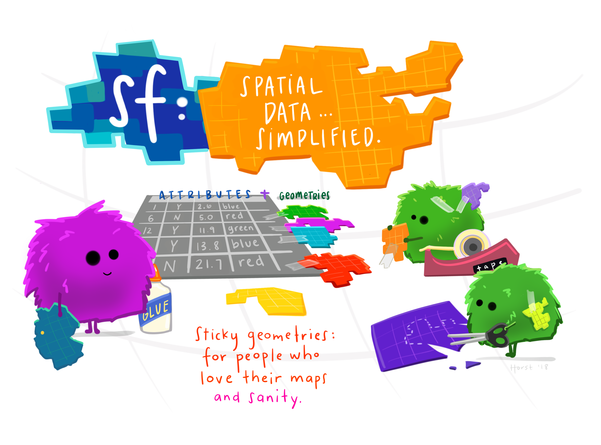

<style>
@import url('https://fonts.googleapis.com/css?family=Lato&display=swap');
</style>

<link rel="stylesheet" href="//fonts.googleapis.com/css?family=Lato" />


```{r rmarkdown-setup, echo = FALSE}
knitr::opts_chunk$set(warning = FALSE)
knitr::opts_chunk$set(message = FALSE)
```

```{r setup}
options(scipen = 999)

library(tidyverse)
```

# Welcome!

Why should you map in R?

* **<font color="#ec008b"> Reproducable. </font>** Writing code provides a road map for other researchers (and future you) on how your map was created and what analysis steps were taken.
* **<font color="#ec008b"> Iteration. </font>** Want to make the same map for 10 different years? Want to make a map of all the counties in each state? This can be as simple as adding one more line of code.
* **<font color="#ec008b"> Easy for analysis. </font>** There are huge benefits to using the same software to run your analysis and then make your map.
* **<font color="#ec008b"> Free and open source. </font>** We are lucky and have great access to software at Urban- but outside of work, it can be expensive (financially and computationally) to use other GIS software.

# Getting Started with R

A few basics:

* What is R Studio? 
* The console and the global environment
* The assignment operator
* R packages
* R projects

# Exercise 0

<font color="#55b748">**Step 1:**</font> Create a new directory called `mapping`

<font color="#55b748">**Step 2:**</font> Open RStudio. Click "Project: (None)" in the top right corner. Click "New Project" and create a project based on the existing `mapping` directory.

<font color="#55b748">**Step 3:**</font> Open a `.R` script with the button in the top left. Save the script as `01_intro-to-mapping.R`.

<font color="#55b748">**Step 4:**</font> Submit `install.packages("tidyverse")` to the Console.

<font color="#55b748">**Step 5:**</font> Submit `install.packages("devtools")` to the Console.

<font color="#55b748">**Step 6:**</font> Submit `remotes::install_github("UrbanInstitute/urbnmapr")` to the Console.

<font color="#55b748">**Step 7:**</font> Submit `remotes::install_github("UrbanInstitute/urbnthemes")` to the Console.

<font color="#55b748">**Step 8:**</font> Write `library(tidyverse)`, `library(urbnmapr)`, and `library(urbnthemes)` at the top of `01_intro-to-mapping.R`. With the cursor on the line of text, click Control-Enter.

# Exercise 1

<font color="#ec008b"> **`ggplot2` syntax** </font>

* <font color="#ec008b">**1 Data**</font> are the values represented in the visualization.

* <font color="#ec008b">**2 Aesthetic mappings**</font> are directions for how data are mapped in a plot in a way that we can perceive. Aesthetic mappings include linking variables to the x-position, y-position, color, fill, shape, transparency, and size. 

* <font color="#ec008b">**3 Geometric objects**</font> are representations of the data, including points, lines, and polygons. The most common geom that we will use for mapping is `geom_sf()`.

<font color="#55b748">**Step 1:**</font> Type the following code into your script.

```
states <- get_urbn_map(map = "states", sf = TRUE)
```
Type `View(states)` into your console.

<font color="#55b748">**Step 2 **</font> Type the following code into your script.

```
ggplot() +
  geom_sf(data = states, mapping = aes())
```

<font color="#55b748">**Step 3 **</font> Change the color of the states to be Urban cyan (#1696d2) and the outline of the states to be white.

```
ggplot() +
  geom_sf(data = states, mapping = aes(),
          fill = "#1696d2", color = "white")
```

<font color="#55b748">**Step 4**</font> Remove the gridlines and axis labels from the map by adding ` + theme_urbn_map()` to the end of the map.

# Exercise 2

<font color="#55b748">**Step 1:**</font> Copy and paste the following code into your script.

```
data <- read_csv("https://raw.githubusercontent.com/UI-Research/urbn101-mapping/day1/data/state_data.csv?token=AHJ7BDMLC7LYH4P2NM5A5EC5PZYCW")
```

Type `View(data)` into the console.

<font color="#55b748">**Step 2:**</font> Merge the dataset with the geographic data using `left_join()`. Make sure that the geographic data is on the left side of the join.

```
geo_data <- left_join(states, data, by = "state_name")
```

<font color="#55b748">**Step 2:**</font> Use `ggplot()` to map the variable `medhhincome`. Hint: use the same code from the previous map, but move the `fill =` command to inside the `aes()`.

<font color="#55b748">**Step 3:**</font> Type `set_urbn_defaults(style = "map")` near the top of your script.

<font color="#55b748">**Step 4:**</font> Add the line ` + scale_fill_gradientn(labels = scales::dollar)` to the map. What changed?

<font color="#55b748">**Step 5:**</font> Change the outline of the states to be white.


# Exercise 3

<font color="#55b748">**Step 1:**</font> Using the same `geo_data` dataframe, we will now map a categorical variable.

```
ggplot() +
  geom_sf(data = geo_data, mapping = aes(fill = cat_var))
```
<font color="#55b748">**Step 2:**</font> Change the colors on the map to four other Urban colors using `scale_fill_manual()`. (Hint: type `view_palette()` into the console to get hex codes for Urban colors. Use `values = ` and a vector of hex codes).

<font color="#55b748">**Step 3:**</font> Change the title of your legend by adding `+ labs(fill = "My categorical variable")`.

# What are simple features?

```{r}



```
Artwork by @allison_horst

