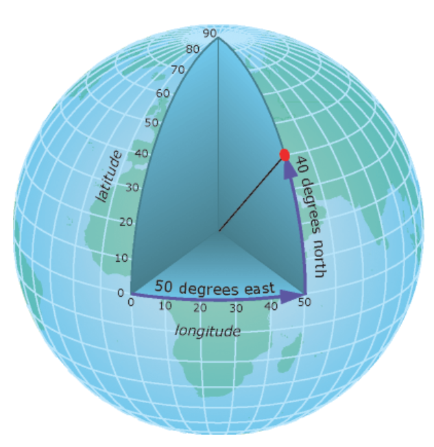

  

<style>
@import url('https://fonts.googleapis.com/css?family=Lato&display=swap');
</style>

<link rel="stylesheet" href="//fonts.googleapis.com/css?family=Lato" />


```{r rmarkdown-setup, echo = FALSE}
knitr::opts_chunk$set(warning = FALSE)
knitr::opts_chunk$set(message = FALSE)
```


# Review 

* Making maps in R is really powerful and easy
* The `sf` package handles point and polygon spatial data
* sf objects are dataframes with an additional geometry column

```{r, warning=F, message=F, eval = T}
library(tidyverse)
library(sf)
library(urbnmapr)
library(urbnthemes)
library(tigris)
set_urbn_defaults(style = "map")
```

### Exercise 0: Create a Project (if you didn't do this last week)

<font color="#55b748">**Step 1:**</font> Create a new directory called `mapping`

<font color="#55b748">**Step 2:**</font> Open RStudio. Click "Project: (None)" in the top right corner. Click "New Project" and create a project based on the existing `mapping` directory.

<font color="#55b748">**Step 3:**</font> Submit `install.packages("tidyverse")` to the Console.

<font color="#55b748">**Step 4:**</font> Submit `install.packages("devtools")` to the Console.

<font color="#55b748">**Step 5:**</font> Submit `remotes::install_github("UrbanInstitute/urbnmapr")` to the Console.

<font color="#55b748">**Step 6:**</font> Submit `remotes::install_github("UrbanInstitute/urbnthemes")` to the Console.

<font color="#55b748">**Step 7:**</font> Write `library(tidyverse)`, `library(urbnmapr)`, and `library(urbnthemes)` at the top of `01_intro-to-mapping.R`. With the cursor on the line of text, click Control-Enter.

### Exercise 0: Setup
<font color="#55b748">**Step 1:**</font> Open a `.R` script with the button in the top left. Save the script as `02_import_export.R`.

<font color="#55b748">**Step 2:**</font> Submit `install.packages("tigris")`, into the console and wait for the package to install.

<font color="#55b748">**Step 2:**</font> Copy and paste the following to the top of `02_import_export.R`. This loads in all the necessary libraries for today. With the cursor highlighting all the below text, click Control-Enter.

```
library(urbnmapr)
library(urbnthemes)
library(tidyverse)
library(sf)
library(tigris)
set_urbn_defaults(style = "map")
```


# Reading in spatial data

 Out in the wild, spatial data comes in [many formats](https://geocompr.robinlovelace.net/read-write.html#file-formats) but some of the common ones you will encounter are:

* CSV's with lon/lat columns
* GeoJSON's (.geojson)
* Shapefiles (.shp)

the `sf` package has a function called `st_read()` that makes reading in any of these types of files easy. The function takes in an argument called `dsn` or data source name

<font color="#ec008b"> For GeoJSONs and Shapefiles:</font>

```
data <- st_read(dsn = "path/to/geojson/file.geojson")
data <- st_read(dsn = "path/to/shp/file.shp")
```

<font color="#ec008b"> For CSV's:</font> You have two options! <br><br />
1- Read in the file using st_read, but manipulate some GDAL options

```
data <- st_read(dsn = "path/to/csv/file.csv",
  options = c("X_POSSIBLE_NAMES=lon", "Y_POSSIBLE_NAMES=lat")
)
```
2- Read in the file as a data frame and convert it to an sf object

```

data <- read_csv("path/to/csv/file.csv")
data <- st_as_sf(data, coords = c("lon", "lat"))
```
**NOTE: X = Longitude & Y = Latitude.** You will at some point mix these two up, but try to keep them straight.

`st_read` can also accept URL's!

```
data <- st_read("https://opendata.arcgis.com/datasets/287eaa2ecbff4d699762bbc6795ffdca_9.geojson")
```

Notice that it  figured out what filetype it was and what kind of spatial data it was.


### Exercise 1: Read in a GeoJSON

<font color="#55b748">**Step 1:**</font> Read in data on the locations of all fire stations in DC. Create a variable named `fire_stations` and using `st_read`, read in the following GeoJSON from this URL: https://maps2.dcgis.dc.gov/dcgis/rest/services/DCGIS_DATA/Public_Safety_WebMercator/MapServer/6/query?where=1%3D1&outFields=NAME,ADDRESS,TRUCK,AMBULANCE&outSR=4326&f=geojson

<font color="#55b748">**Step 2:**</font> Type in `fire_stations` into your console and press enter. What does this SF dataframe look like? 

### Exercise 2: Read in a CSV
<font color="#55b748">**Step 1:**</font> Copy and paste the following link into your browser to download the CSV to your computer. It's a dataset on all crimes in DC within the last 30 days.
https://geocoding-codestar-test.s3.us-east-2.amazonaws.com/crime_last_30_days.csv

<font color="#55b748">**Step 1:**</font> Create a folder called `data` in your mapping101 folder, and move the downloaded CSV into that folder

<font color="#55b748">**Step 2:**</font> Find the filepath to the CSV (it should be something like 'data/example.csv') and read it into R as an sf dataframe named `crime_30`. Note: You may need to open the CSV to see what the X and Y columns are labelled as. You can use any of the two methods described above


# Writing out spatial data 
  
sf has a function called `st_write` that can write out sf objects as GeoJSON's, shapefiles, CSVS, Geopackages, or just about any other spatial format supported by [GDAL](https://gdal.org/drivers/vector/index.html). Shapefiles have been the defacto standard used by spatial developers and GIS professionsal for the past 20+ years, but they have some serious problems:

  1) A shapefile is composed of atleast 3 files, making data transfer tricky
  2) Their file size is limited to 2 GB
  3) It's a closed source propietary ESRI file format (though drivers to read/write shapefiles have been open sourced)
  4) Column names are limited to 10 characters
  
We highly recommend saving your spatial files as GeoJSON's for for a few reasons:

  1) It's an open source file format that can easily be read back into R, ArcGIS, or Python
  2) It uses standardized projections and naming conventions, which saves you a lot of headaches down the road
  3) It's a lightweight single file, makes it easy to transfer small to medium sized files
  4) It doesn't have any file size limitations! Though if you have really large spatial files, you should look into geopackages
  


Here is how you would write out different file formats using `sf`

<font color="#ec008b"> Writing out GeoJSONs and Shapefiles: </font>

```
st_write(sf_data, "output/path/filename.geojson")
st_write(sf_data, "output/path/filename.shp")
```


<font color="#ec008b"> Writing out CSV's </font>

There may be some cases when you need to write out your spatial data as a CSV to share with other folks. sf does let you do that, but the lat/lon columns will either be labelled X/Y or be a single WKT column. 

|X|Y|
|-|-|
|-76.9651|38.89204|


|WKT|
|:--|
|POINT (-76.9651, 38.89204)|

Here's how you write out CSV's both ways using `sf_write`:

``````{r, eval = F}
# Writing out X and Y columns to CSV
st_write(sf_data, "C:/Users/anarayanan/Downloads/exparkslocations.csv",
  layer_options = "GEOMETRY=AS_XY"
)

# Writing out WKT columns to CSV
st_write(sf_data, "C:/Users/anarayanan/Downloads/exparkslocations.csv",
  layer_options = "GEOMETRY=AS_WKT"
)
```

But sometimes, we want to write out CSVs with human readable Latitude and Longitude columns instead of X and Y columns as they are easy to mix up (quick - is X latitude or longitude?).SF doesn't give you the ability to do this easily. So we need to extract the coordinates from the SF dataframe, append them as columns to our dataframe, then rename them latitude/longitude.

```{r, eval = F}
# getting lon/lat columns from dataframe
coords <- st_coordinates(data) %>% 
  as_tibble() %>% 
  dplyr::rename(lon = X, lat = Y)

# appending lon/lat columns to dataframe
data_to_write <- data %>% 
  st_set_geometry(NULL) %>% 
  bind_cols(coords)

# writing out dataframe as csv
write_csv(data_to_write, "path/to/file.csv")
```


### Exercise 3: Writing out Spatial data
<font color="#55b748">**Step 1:**</font> Let's say we were only interested in relatively large fire stations. Use the `filter()` function to limit the `fire_stations` dataframe to stations that have more than 5 trucks (ie `TRUCKS > 5`). Call this filtered dataframe `big_stations`

<font color="#55b748">**Step 2:**</font> Write out the `big_stations` dataframe as a GeoJSON into the `data\` folder we created earlier using `st_write()`. Call the file `big_stations.geojson`.

<font color="#55b748">**Step 3:**</font> Write out the `big_stations` dataframe as a CSV with lat/lon columns into the `data\` folder we created earlier using `st_write()`. Call the file `big_stations.csv`. 


# Where can I find spatial data?

The `tigris` package in R is a great place to start looking. `tigris` provides spatial data for:

* Census Tracts, Blocks, & Block Groups
* Counties, ZCTA's, PUMA's, Places
* congressional districts, School Districts
* roads, railways, native areas, military bases
* Lots of other data sources!

It provides powerful functionality by allowing you to filter to specific states, counties, or tracts. Say for example I wanted data on all block groups in DC

```{r, fig.width=3, fig.height =3, eval = T, message = F, warning = F}
dc_tracts <- tigris::block_groups(
  state = "DC",
  year = 2017,
  class = "sf",
  progress_bar = FALSE
)

ggplot() +
  geom_sf(data = dc_tracts, mapping = aes())
```


There's also a sister package called `tidycensus` that provides easy access to census data in addition to spatial data. Say for example you wanted data on the population counts in Montgomery County census tracts from from the 1 year ACS:

```{r, eval = F}
# Note you need to sign up for a free Census API key here:
# http://api.census.gov/data/key_signup.html

api_key <- '12345678'
x <- get_acs("tract", year = 2016, endyear = 2016, 
            state = "MD", county = "Montgomery", 
            geometry = TRUE, key = api_key)

```


Below are some other common places to find spatial data

* [Open Data Portals](https://opendata.dc.gov/)
* [IPUMS NHGIS](https://www.nhgis.org/documentation/gis-data)


### Exercise 4: Using tigris
<font color="#55b748">**Step 1:**</font> Use the `school_districts()` function in tigris to download all the school districts in Oregon from the year 2015. Call the variable `or_school_districts.` Make sure to set `class = "sf"`!

<font color="#55b748">**Step 2:**</font> Use `ggplot()` and `geom_sf()` to make a plot of all the school districts in Oregon


# Coordinate Reference Systems

Whenever you create a map you have to make assumptions about 1) the exact 3d shape of the earth and 2) how to project that 3d shape onto a 2d surface. That's where Coordinate Reference Systems (CRS) come in! There are two kinds of Coordinate Reference Systems:

1) [**Geographic coordinate systems**](https://www.ibm.com/support/knowledgecenter/en/SSGU8G_12.1.0/com.ibm.spatial.doc/ids_spat_407.htm): 
  - Are a 3d representation of the earth
  - Uses spheroid/ellipsoid surface to approximate shape of the earth
  - Usually use decimal degree units (ie latitude/longitude) to identify locations on earth

```{r, eval = T, echo = F, out.width = 300, out.width=300}

```

2) [**Projected coordinate systems**]()
  - Are 2d representations of the earth
  - Is a particular geographic coordinate system + a particular *projection*
    - **projection**: mathematical formula used to convert a 3d coordinate system to a 2d flat coordinate system
    - Many different kinds of projections, including Equal Area, Equidistant, Con formal
    - All projections distort the true shape of the earth in some way, either in terms of shape, area, or angle. Required [xkcd comic](https://xkcd.com/977/)
  - Usually use linear units (ie feet, meters) and therefore useful for distance based spatial operations (ie creating buffers)
  
Below is a gif showing how the popular but Eurocentric Mercator projection works


### Finding and Setting CRS

In `sf` there's a function called `st_crs()` that will tell us what the CRS of an sf dataframe is. Let's use that on our `fire_stations` dataframe
```{r, echo = F, eval = T, warning=F, message =F}
fire_stations = sf::st_read("https://maps2.dcgis.dc.gov/dcgis/rest/services/DCGIS_DATA/Public_Safety_WebMercator/MapServer/6/query?where=1%3D1&outFields=NAME,ADDRESS,TRUCK,AMBULANCE&outSR=4326&f=geojson", quiet =T)
```
 
```{r, eval = T}
st_crs(fire_stations)
```

As you can see there is an `EPSG` code and a `proj4` string, either of which can uniquely identify the CRS being used. The `EPSG` codes are usually easier to work with and are a string of 4-6 numbers that represent CRS definitions. The acronym `EPSG`, comes from the now defunct European Petrol Survey Group. Good resources for learning more about an `EPSG` code (such as their default units and main areas of use) are [spatialreference.org](https://spatialreference.org/) and [epsg.io](https:://epsg.io)

After you read spatial data into R, the first thing you should do is check that the CRS is specified, In most cases, `sf` should automatically detect the right CRS, but sometimes it fails and the CRS may be empty. In this case it's up to you to provide the CRS (ie the EPSG code). You can set the CRS using `st_set_crs()`. You can also transform the CRS (if the data has a non standard CRS you don't want to use) using `st_transform()`. Some tips for finding the EPSG codes of a dataset:

  - For GeoJSON's, the EPSG code will always be 4326 as that is a requirement for all GeoJSON files. 
  - For Shapefiles, you will need to open the .prj file and paste the contents into [http://prj2epsg.org](http://prj2epsg.org) to find the EPSG code
  - For CSV's, assuming you have latitude and longitude points, it's a good bet that the EPSG code is 4326. 
  
  
### Exercise 5: Working with CRS's

<font color="#55b748">**Step 1:**</font> Download the zipped shapefile of Toronto's zoning boundaries from here: ftp://webftp.vancouver.ca/OpenData/shape/zoning_districts_shp.zip

<font color="#55b748">**Step 2:**</font> Unzip the contents of the shapefile into the `data` folder of the `mapping` directory.

<font color="#55b748">**Step 3:**</font> Find the filepath to the `zoning_districts.shp` file in the `data` folder and read the shapefile into R. Name the object `tor_zones`.

<font color="#55b748">**Step 3:**</font> Type `tor_zones` into the console and take a look at the geometry column. Do these points look funky?

<font color="#55b748">**Step 4:**</font> Open the zoning_districts.prj file, copy the contents and use [http://prj2epsg.org](http://prj2epsg.org) to determine the relevant `EPSG` code. 

<font color="#55b748">**Step 5:**</font> Confirm that SF used the correct EPSG code when it read in the shapefile by using `st_crs()` on the `tor_zones` dataframe.  

<font color="#55b748">**Step 6:**</font>  Use [epsg.io](https://epsg.io) to find out what the units of this CRS is. 

<font color="#55b748">**Step 7:**</font> The actual coordinates of this coordinate system may look foreign to people used to lat/lons. So transform the CRS to 4326 to get latitude/longitude points. Name the transformed dataframe `tor_zones_transformed`.  

